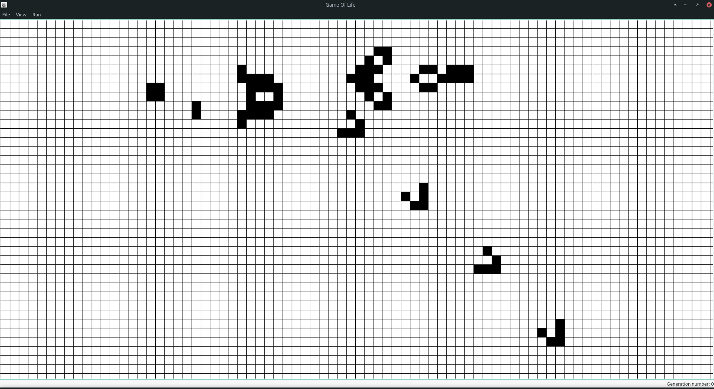

# Conway's Game Of Life Visualizer
Desktop app to graphically visualize Conway's Game Of Life with user manipulable inputs

## General Description
This is a graphical representation of [Conway's Game Of Life](https://en.wikipedia.org/wiki/Conway%27s_Game_of_Life).
By default each cell is white which represents the `dead` state. Each cell can be changed to `alive` by double clicking 
the cell. In fact, doubling clicking will flip the cell state either from `dead` to `alive` or vice-versa. The board 
view can be zoomed in and out using the mouse scroll wheel and the board can be panned left, right, up and down using 
the respective arrow keys.

#### File Dropdown Menu
- `New Board` erases all currently alive cells and resets the zoom
- `Quit` exits the application

#### View Dropdown Menu
- `Reset Zoom` resets board zoom level to default

#### Run Dropdown Menu
- `Step Forward` advances the current board state forward by one generation
- `Run` repeatedly advances the current board state forward by one generation until `Stop` is clicked
- `Stop` stops the board from repeatedly advancing forward
- `Increase Speed` increases the frequency in which the board advances forward
- `Decrease Speed` decreases the frequency in which the board advances forward
- `Reset Speed` resets the frequency in which the board advances forward to default.

## What Is This Good For?
Experimenting with the implications and the possible board state configurations of the three simple rules that the 
cells obey by (there is still lots to discover)!

## Building the Source Code
1. Clone this repository into a folder.
2. `cd` into the folder containing the project level `CMakeLists.txt`.
3. Make a folder to build the binaries (it can be anywhere but a simple solution would just make a folder called `build`
   in the same folder as the main `CMakeLists.txt`. This will be referred to as `builddir`. To prevent polluting the 
   source code, the `CMakeLists.txt` scripts **DO NOT** allow building in the **same directory as the source code**!
4. Run `cmake . -B<builddir>` where `builddir` is the previously made folder to build the binaries.
5. `cd` into `builddir` and run `make`. The built binary will be in the folder `GameOfLife` inside the `builddir`.

## Notes On Dependencies
- `Catch2` is used as the unittest framework. Building the tests requires `Catch2`. 
  This can be installed [here](https://github.com/catchorg/Catch2) or by using your package manager.
- `Qt` is used as the GUI framework. Building the app requires `Qt` libraries which can be found 
  [here](https://www.qt.io/download) or by using your package manager